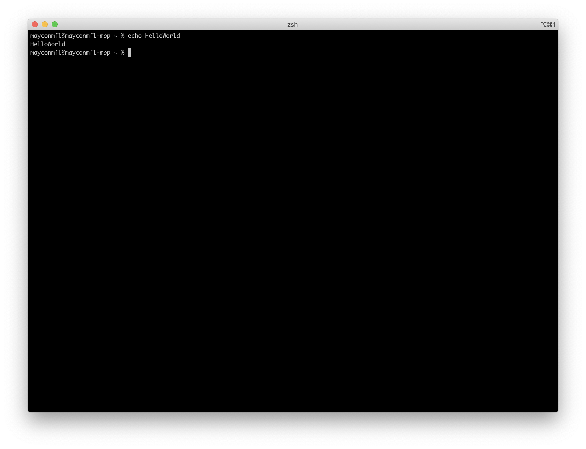
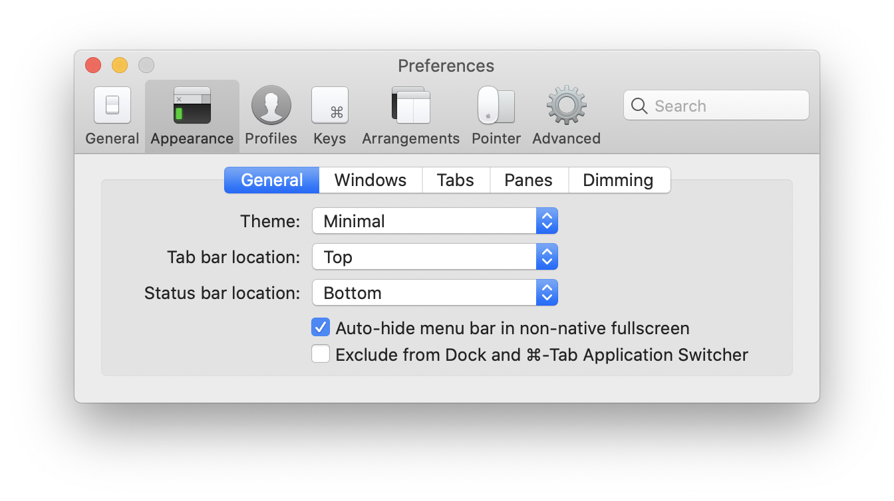
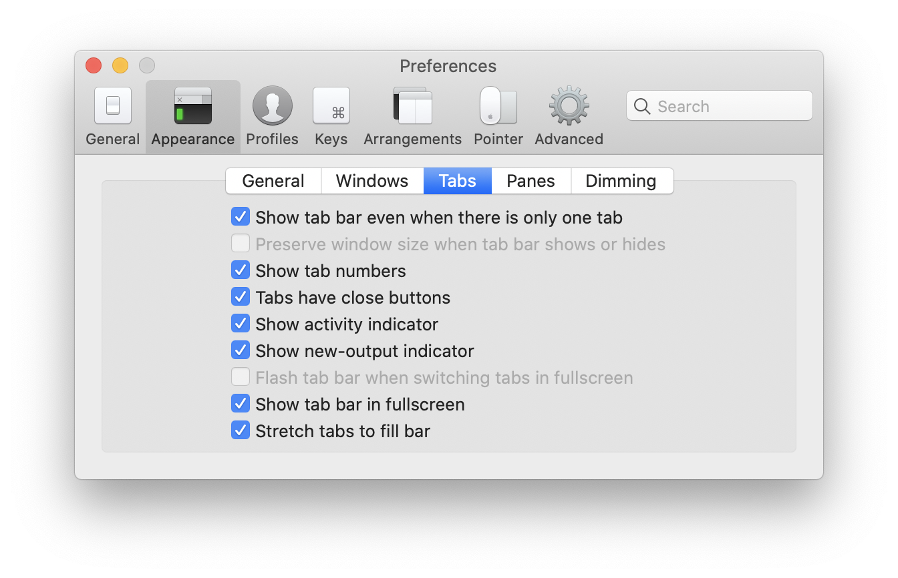
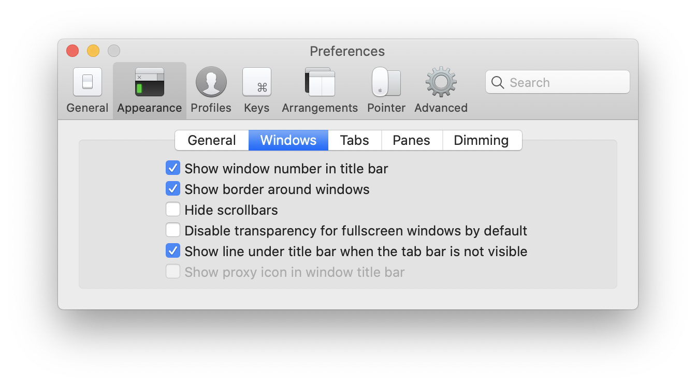
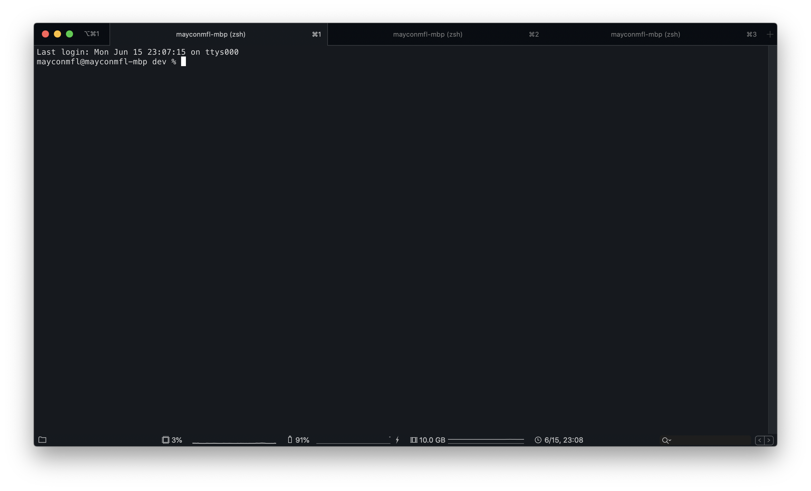

# My iTerm2 Terminal Config

## Install iTerm2

    brew cask install iterm2 
    
- Or directly download... [Download](http://www.iterm2.com/downloads.html) 

#### Add Color Schemes

- Choose the zip file... [Download](https://iterm2colorschemes.com/)
- iTerm 2 > CMD+i > Colors tab > Click on Load Presets > Click on Import
- Select the .itermcolors file(s) from scheme folder
- Click on Load Presets and choose a color scheme

----

# Default Config and Profile

# My Custom Profile

  - iTerm 2 > CMD+, > Profile Tab > Click on Other Actions > Import JSON Profiles... > Select Default
  - iTerm 2 > CMD+, > Appearence Tab > Check the images and reproduce

## Final Result

